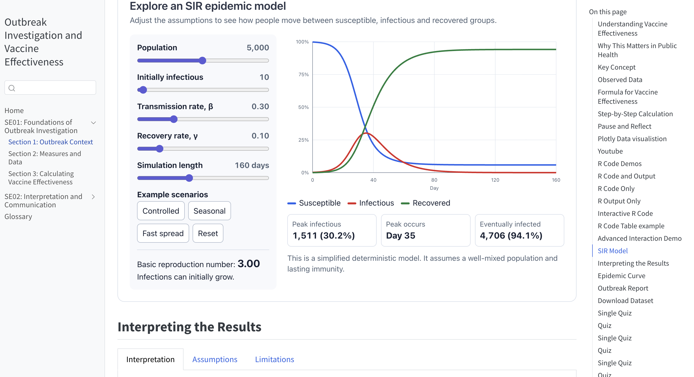

# CloudPedagogy Learning Publisher

CloudPedagogy Learning Publisher is a Word-first publishing system for creating accessible, maintainable online learning with Quarto. Authors work primarily in Microsoft Word, while a course-local YAML file defines structure, navigation, source documents and publication settings.

## What it produces

Depending on the course configuration, Learning Publisher can create:

- Multi-page Quarto course websites
- Printable HTML
- Individual page outputs and combined Word/PDF handbooks
- Static R examples and browser-based WebR activities
- Self-checks, quizzes, reveals, tabs and callouts
- Images, downloadable files, video and standalone HTML embeds
- Self-contained JavaScript interactions supplied as one `.js` file

## Live demo

[Open the Outbreak Investigation and Vaccine Effectiveness demo](http://cloudpedagogy-learning-publisher.s3-website.eu-west-2.amazonaws.com/outbreak_ve_demo/se01/OUTBREAK_VE_DEMO-se01-sec01-sp01.html)

[](http://cloudpedagogy-learning-publisher.s3-website.eu-west-2.amazonaws.com/outbreak_ve_demo/se01/OUTBREAK_VE_DEMO-se01-sec01-sp01.html)

## Publishing workflow

```text
Course folder
├── course.yml
├── docx/
├── code/
└── resources/
        ↓
Validate → Build → Import Word → Build handbook → Render
        ↓
Website and configured document outputs
```

Word documents remain the editable content source. The course's `course.yml` defines the hierarchy, page identifiers, titles and source-document paths. The importer converts supported Word directives into Quarto-compatible Markdown and HTML.

## Requirements

- Python 3.10 or later (Python 3.13 is recommended for the current project)
- Quarto
- Pandoc, normally provided with Quarto
- Git
- TinyTeX when PDF output is required
- R and the required packages when static R code is executed during rendering

Check the main tools:

```bash
python3.13 --version
quarto --version
pandoc --version
```

If `python3.13` is unavailable but `python3` is a suitable version, substitute `python3` in the setup command below.

Install TinyTeX when PDF publishing is required:

```bash
quarto install tinytex
```

## Installation

Clone the repository and enter it:

```bash
git clone https://github.com/cloudpedagogy/cloudpedagogy-learning-publisher.git
cd cloudpedagogy-learning-publisher
```

Create and activate a virtual environment on macOS or Linux:

```bash
python3.13 -m venv .venv
source .venv/bin/activate
```

On Windows PowerShell:

```powershell
py -3.13 -m venv .venv
.venv\Scripts\Activate.ps1
```

Install the project in editable mode:

```bash
python -m pip install --upgrade pip
python -m pip install -e .
```

The virtual environment is created only once. On later visits, enter the repository and reactivate it with:

```bash
source .venv/bin/activate
```

The Terminal prompt should then begin with `(.venv)`.

## Quick start

From the repository root, run these commands in order:

```bash
python -m course_generator.cli validate imports/courses/outbreak_ve_demo/course.yml

python -m course_generator.cli build imports/courses/outbreak_ve_demo/course.yml

python -m course_generator.cli import-word imports/courses/outbreak_ve_demo/course.yml

python src/course_generator/tools/build_handbook_from_quarto.py build/courses/outbreak_ve_demo

python -m course_generator.cli render imports/courses/outbreak_ve_demo/course.yml --no-versioned

open output/courses/outbreak_ve_demo/index.html
```

The final `open` command is for macOS. On other systems, open `output/courses/outbreak_ve_demo/index.html` in a browser.

The stages are:

1. `validate` checks the course YAML.
2. `build` creates or updates the generated Quarto project under `build/courses/`.
3. `import-word` converts the configured Word sources and inserts them into the generated pages.
4. The handbook utility assembles the combined handbook source; rendering produces the configured handbook outputs.
5. `render` publishes the course under `output/courses/`.

Use `--no-versioned` during routine testing so the same output folder is replaced. Omit it when you want the renderer's default versioned output behaviour.

Run `build` before `import-word`. Run `import-word` again after changing a Word document or one of its referenced code files, then rerun the handbook and render stages.

For command-specific options:

```bash
python -m course_generator.cli --help
python -m course_generator.cli build --help
python -m course_generator.cli render --help
python src/course_generator/tools/build_handbook_from_quarto.py --help
```

## Course structure

Each course is self-contained under `imports/courses/`:

```text
imports/courses/outbreak_ve_demo/
├── course.yml
├── docx/
│   ├── 01_vaccine_effectiveness_outbreak.docx
│   └── course_glossary.docx
├── code/
│   ├── outbreak-risk-table.R
│   └── sir-model-interaction.js
└── resources/
    ├── data/
    ├── html/
    ├── images/
    ├── pdf/
    └── video/
```

The old top-level `config/` folder is not required for courses that have their own `course.yml`. Course-relative paths in that file are resolved from the folder containing `course.yml`:

```yaml
subpages:
  - id: OUTBREAK_VE_DEMO-se01-sec01-sp01
    title: "Outbreak Context"
    kind: text_page
    source_docx: "docx/01_vaccine_effectiveness_outbreak.docx"
```

The principal hierarchy is `module` → `sessions` → `sections` → `subpages`.
Standalone pages, such as a glossary, can be declared alongside the sessions.

## Authoring courses

Authors create content in Word and configure course structure through the
course-local `course.yml`. Routine authors do not need to write Quarto Markdown
directly.

Learning Publisher supports reveals, self-checks, callouts, tabs, quizzes,
static R and WebR content, plain JavaScript interactions, images, downloadable
resources, video and standalone HTML activities.

## Documentation

For complete guidance to installing, configuring, authoring, building,
publishing and maintaining Learning Publisher courses, see the
[Learning Publisher Handbook](HANDBOOK.md).

For detailed Word authoring conventions, directive syntax and examples, see the
[Learning Publisher Authoring Guide](docs/AUTHORING_GUIDE.md).

## Project structure

```text
assemblies/     Publication assembly configuration
imports/        Course-local YAML, Word sources, code and resources
src/            Python application code
templates/      Quarto and interaction templates
build/          Generated Quarto working projects
output/         Rendered publications
tests/          Automated tests
tools/          Shell and PowerShell helper scripts
docs/           Extended operational and author documentation
```

## Source and generated files

Treat `imports/`, `src/`, `templates/`, `assemblies/` and intentional reusable resources as project inputs. The `build/` and `output/` directories are generated and can normally be recreated.

Do not commit temporary Word lock files, Python caches or download packaging:

```gitignore
__pycache__/
*.py[cod]
~$*.docx
```

Do not ignore all ZIP files globally when a course intentionally includes ZIP resources such as downloadable datasets.

## Tests

After changing the Python application, run the automated tests when available:

```bash
python -m pytest
```

This is a repository health check and is not required for every routine course build.

## Companion project

- [CloudPedagogy Word Course Splitter](https://github.com/cloudpedagogy/cloudpedagogy-word-course-splitter)

## Licence

See [LICENSE](LICENSE) for licensing information.
