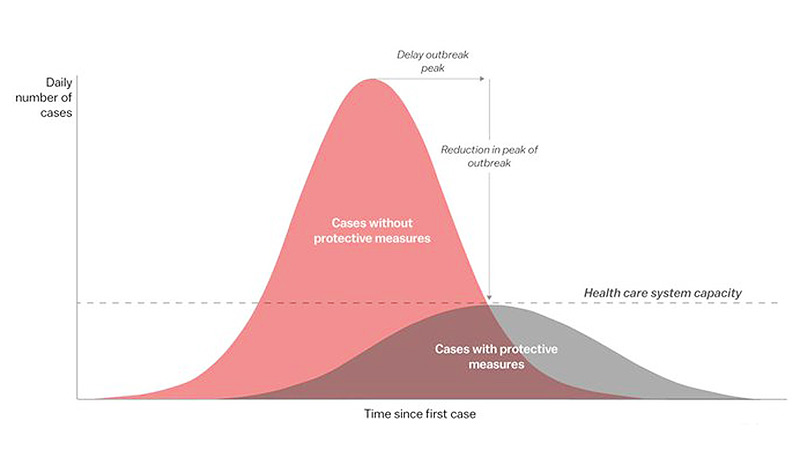

\newpage

# SE01: Foundations of Outbreak Investigation

## Section 1: Outbreak Context


### Outbreak Context

An outbreak of **measles**, a highly contagious viral disease, occurred in a semi-urban community with mixed vaccination coverage. Measles is one of the most transmissible infectious diseases, with a basic reproduction number ($R_0$) often estimated between 12 and 18.

Public health teams initiated an outbreak investigation to:

- identify confirmed and suspected cases

- determine vaccination status

- assess transmission patterns

- estimate the **real-world effectiveness of the vaccine**

For an overview of measles epidemiology, see:
<https://www.who.int/news-room/fact-sheets/detail/measles>

## Understanding Vaccine Effectiveness

Vaccine effectiveness (VE) refers to how well a vaccine performs in real-world conditions, outside controlled clinical trials.

Unlike vaccine efficacy, effectiveness reflects:

- population diversity

- variation in exposure

- real-world healthcare access

- behavioural factors

👉 Learn more:
<https://www.who.int/news-room/feature-stories/detail/vaccine-efficacy-effectiveness-and-protection>

## Why This Matters in Public Health

Estimating vaccine effectiveness is essential for:

- evaluating vaccination programmes

- identifying vulnerable populations

- informing outbreak response

- guiding policy decisions

For further reading:
<https://pmc.ncbi.nlm.nih.gov/articles/PMC6734418/>

##  Key Concept

**Important**

Vaccine effectiveness measures the reduction in disease risk among vaccinated individuals compared to unvaccinated individuals in real-world conditions.
\"Lorem ipsum dolor sit amet, consectetur adipiscing elit, sed do eiusmod tempor incididunt ut labore et dolore magna aliqua. Ut enim ad minim veniam, quis nostrud exercitation ullamco laboris nisi ut aliquip ex ea commodo consequat. Duis aute irure dolor in reprehenderit in voluptate velit esse cillum dolore eu fugiat nulla pariatur. Excepteur sint occaecat cupidatat non proident, sunt in culpa qui officia deserunt mollit anim id est laborum.\"

## Observed Data

The following table summarises the number of cases and non-cases among vaccinated and unvaccinated individuals during the outbreak.

  --------------------------------------------------------
  **Group**      **Cases (a, c)**   **Non-cases (b, d)**
  -------------- ------------------ ----------------------
  Vaccinated     4                  96

  Unvaccinated   20                 80
  --------------------------------------------------------

Table: Summary of outbreak cases by vaccination status

## Formula for Vaccine Effectiveness

Vaccine effectiveness is calculated as:

VE = (1 − Relative Risk) × 100

## Step-by-Step Calculation

**Steps**

1. Calculate risk in the vaccinated group: 5 / 500 = 0.01
- \"Lorem ipsum dolor sit amet, consectetur adipiscing elit, sed do eiusmod tempor incididunt ut labore et dolore magna aliqua. Ut enim ad minim veniam, quis nostrud exercitation ullamco laboris nisi ut aliquip ex ea commodo consequat. Duis aute irure dolor in reprehenderit in voluptate velit esse cillum dolore eu fugiat nulla pariatur. Excepteur sint occaecat cupidatat non proident, sunt in culpa qui officia deserunt mollit anim id est laborum.\"

2. Calculate risk in the unvaccinated group: 25 / 500 = 0.05

3. Relative Risk = 0.01 / 0.05 = 0.2

4. VE = (1 − 0.2) × 100 = 80%

## Pause and Reflect

**Tip**

**Self-check:** Why might vaccine effectiveness differ between populations?

**Suggested answer**

Differences in exposure, population structure, healthcare access, and underlying health conditions can influence estimates.
\"Lorem ipsum dolor sit amet, consectetur adipiscing elit, sed do eiusmod tempor incididunt ut labore et dolore magna aliqua. Ut enim ad minim veniam, quis nostrud exercitation ullamco laboris nisi ut aliquip ex ea commodo consequat. Duis aute irure dolor in reprehenderit in voluptate velit esse cillum dolore eu fugiat nulla pariatur. Excepteur sint occaecat cupidatat non proident, sunt in culpa qui officia deserunt mollit anim id est laborum.\"

## Youtube

[Watch video on YouTube](https://www.youtube.com/watch?v=yt3e8Ng0mf0)

## Panopto

[Watch video on Panopto](https://lshtm.cloud.panopto.eu/Panopto/Pages/Embed.aspx?id=d19ba573-9ad1-480b-95db-b3ed01014aab)
## R Code Demos  R Code and Output

```{r}
#| echo: true
#| fig-alt: "Bar chart showing risk of infection for vaccinated and unvaccinated groups."
#| fig-cap: "Risk of Infection by Vaccination Status"
group <- c("Vaccinated", "Unvaccinated")
cases <- c(5, 25)
population <- c(500, 500)
risk <- cases / population
barplot(
risk,
names.arg = group,
col = c("steelblue", "tomato"),
main = "Risk of Infection by Vaccination Status"
)
```

## R Code Only

```{r}
#| echo: true
#| eval: false
group <- c("Vaccinated", "Unvaccinated")
cases <- c(5, 25)
population <- c(500, 500)
risk <- cases / population
barplot(
risk,
names.arg = group,
col = c("steelblue", "tomato"),
main = "Risk of Infection by Vaccination Status"
)
```

## R Output Only

```{r}
#| echo: false
#| fig-alt: "Bar chart comparing infection risk between vaccinated and unvaccinated groups."
#| fig-cap: "Risk of infection by vaccination status"
group <- c("Vaccinated", "Unvaccinated")
cases <- c(5, 25)
population <- c(500, 500)
risk <- cases / population
barplot(
risk,
names.arg = group,
col = c("steelblue", "tomato"),
main = "Risk of Infection by Vaccination Status"
)
```

## Interactive R Code

```{r}
days <- 1:10
cases <- c(2, 4, 7, 12, 18, 15, 11, 7, 4, 2)
barplot(
cases,
names.arg = days,
col = "steelblue",
xlab = "Day",
ylab = "Number of Cases",
main = "Simulated Epidemic Curve"
)
```

## R Code Table example

```{r}
data <- data.frame(
Group = c("Vaccinated", "Unvaccinated"),
Cases = c(5, 25),
Population = c(500, 500)
)
data$Risk <- data$Cases / data$Population
data
```

## Interpreting the Results

## Interpretation
An 80% vaccine effectiveness means vaccinated individuals have substantially lower risk compared to unvaccinated individuals.

## Assumptions
The calculation assumes both groups are comparable and equally exposed.

## Limitations
Confounding factors such as age, immunity, or healthcare access may influence results.

## Epidemic Curve

{width='70%' fig-alt="Epidemic curve showing number of measles cases over time by vaccination status"}

## Outbreak Report

Embedded PDF: View full outbreak investigation report

Resource file: `outbreak-report.pdf`

## Download Dataset

Resource file: `outbreak-dataset.zip`

## Quiz

Based on the outbreak data, what does a vaccine effectiveness of 80% mean in practice?

**Options**

- Vaccinated individuals have zero risk of infection
- Vaccinated individuals have an 80% lower risk of infection than unvaccinated individuals
- 80% of vaccinated individuals will not become infected
- The vaccine prevents 80 cases in every outbreak regardless of context

**Answer**

**Answer:** Vaccinated individuals have an 80% lower risk of infection than unvaccinated individuals

**Explanation:**

Vaccine effectiveness compares the risk of disease in vaccinated and unvaccinated groups under real-world conditions. An 80% VE means the vaccinated group experienced substantially lower risk, not that infection risk was eliminated entirely.

## Key Takeaway

**Tip**

Vaccination significantly reduces the likelihood of infection and severe disease, even if it does not eliminate risk entirely.

## Binomial Theorem equation

$$(x + a)^{n} = \sum_{k = 0}^{n}{\binom{n}{k}x^{k}a^{n - k}}$$

## Latex Equations Approach

**Display equation example**

$$
P(X=x)=\binom{n}{x}p^x(1-p)^{n-x}
$$
## Further Reading

WHO Measles Fact Sheet : <https://www.who.int/news-room/fact-sheets/detail/measles>
Vaccine Effectiveness Overview : <https://www.who.int/news-room/feature-stories/detail/vaccine-efficacy-effectiveness-and-protection>
Measles Vaccine Impact Study : <https://pmc.ncbi.nlm.nih.gov/articles/PMC6734418/>

## Section 2: Measures and Data


### Measures and Data

## Introduction

Outbreak investigations rely on the careful collection, interpretation, and communication of data. During an outbreak, public health teams must rapidly gather information to understand what is happening, who is affected, how the disease is spreading, and what actions may reduce further transmission. Data provides the foundation for decision-making throughout the investigation process.

Measures used in outbreak investigations help transform raw observations into meaningful patterns. These measures allow investigators to estimate the scale of the outbreak, compare affected groups, identify potential sources of infection, and evaluate whether control measures are working. Accurate and timely data collection is therefore essential for effective public health action.

In practice, outbreak data may come from many different sources. These include clinical records, laboratory reports, surveillance systems, interviews, questionnaires, environmental assessments, and population statistics. Each source contributes different types of information, and investigators often need to combine these data sources to build a clearer picture of the outbreak.

Understanding the strengths and limitations of outbreak data is equally important. Early information is often incomplete, uncertain, or rapidly changing. Investigators must therefore interpret findings cautiously while continuing to refine their understanding as new evidence becomes available.

## Types of Data Used in Outbreak Investigations

Outbreak investigations involve both quantitative and qualitative data.

Quantitative data includes measurable information such as age, number of cases, dates of symptom onset, laboratory results, hospital admissions, or vaccination status. These data are often used to calculate frequencies, identify trends, and compare groups.

Qualitative data includes descriptive information gathered through interviews, observations, or open-ended responses. For example, investigators may ask individuals about their recent activities, social interactions, travel history, food consumption, or workplace conditions. These descriptions can provide important clues about possible exposures and transmission routes.

Data can also be classified according to how it is measured.

Categorical data groups individuals into categories such as sex, occupation, vaccination status, or exposure type. Numerical data involves measurable quantities such as age, duration of illness, or number of contacts.

Some outbreak data changes over time. Temporal data helps investigators understand when cases occurred and whether the outbreak is growing, stabilising, or declining. Geographic data helps identify where cases are occurring and whether there are spatial clusters or patterns of spread.

## Key Measures in Outbreak Epidemiology

Several important measures are commonly used during outbreak investigations.

Case counts provide the simplest measure and describe the number of identified cases. Although basic, case counts help establish the size of the outbreak and monitor changes over time.

Incidence measures describe the occurrence of new cases within a population over a specific period. These measures are particularly useful for understanding the speed of transmission and comparing risk across populations.

Attack rates are commonly used in outbreak settings to estimate the proportion of people who become ill after a particular exposure. These measures are especially useful in foodborne outbreaks, institutional outbreaks, or other situations involving clearly defined populations.

Secondary attack rates help investigators understand person-to-person transmission by estimating how many susceptible contacts become infected after exposure to a primary case.

Measures of severity are also important. These may include hospitalisation rates, complication rates, or mortality measures. Such indicators help public health teams assess the impact of the outbreak and prioritise resources.

Measures related to vaccination may also be used, including vaccine uptake within a population and comparisons between vaccinated and unvaccinated groups. These measures can help assess patterns of protection and identify vulnerable populations.

## Descriptive Epidemiology

Descriptive epidemiology forms the early foundation of outbreak investigation. Investigators describe cases according to person, place, and time.

Person-based analysis examines characteristics such as age, sex, occupation, ethnicity, health status, or vaccination history. Identifying which groups are most affected may provide clues about transmission patterns or risk factors.

Place-based analysis focuses on geographic patterns. Cases may cluster within households, schools, workplaces, healthcare facilities, or particular communities. Mapping case locations can help identify hotspots or possible environmental sources.

Time-based analysis examines when cases occur. Tracking symptom onset dates allows investigators to identify trends, estimate exposure periods, and understand the progression of the outbreak.

Together, person, place, and time analyses help generate hypotheses about the source and spread of infection. These descriptive approaches often guide further analytical investigations.

## Data Collection During an Outbreak

Data collection during outbreaks must balance speed, accuracy, and practicality.

Investigators often develop case investigation forms to standardise information gathering. These forms may include demographic information, symptoms, laboratory results, exposure history, travel history, occupation, and contact information.

Interviews are a major source of outbreak data. Depending on the outbreak, interviews may be conducted face-to-face, by telephone, online, or through self-administered questionnaires. Consistency in questioning is important to improve data quality and comparability.

Laboratory data plays a critical role in confirming diagnoses and identifying pathogens. Laboratory testing may also provide information about variants, antimicrobial resistance, or genetic links between cases.

Environmental investigations can contribute additional data. Investigators may inspect facilities, collect food or water samples, assess ventilation systems, or review sanitation practices.

Data quality is a continual concern during outbreaks. Missing data, inaccurate recall, delayed reporting, and inconsistent definitions can affect interpretation. Public health teams therefore need systems for data validation, cleaning, and ongoing review.

## Case Definitions and Standardisation

A clear case definition is essential for consistent data collection.

Case definitions establish criteria for deciding whether an individual should be classified as part of the outbreak. Definitions may include clinical symptoms, laboratory confirmation, epidemiological links, and time or location restrictions.

Outbreak investigations often use different categories such as suspected, probable, and confirmed cases. These categories allow investigators to capture varying levels of certainty while maintaining structured surveillance.

Standardisation improves comparability across teams, regions, and reporting systems. Without consistent definitions and procedures, it becomes difficult to compare findings or accurately assess trends.

Case definitions may evolve during the outbreak as more information becomes available. Early definitions are often broader to maximise case detection, while later definitions may become more specific as understanding improves.

## Interpreting Outbreak Data

Interpreting outbreak data requires caution and critical thinking.

Early outbreak data is frequently incomplete and subject to bias. Some individuals may not seek healthcare, testing capacity may be limited, or reporting systems may lag behind real-world events. As a result, initial estimates may underrepresent the true scale of the outbreak.

Changes in testing practices or surveillance intensity can also affect apparent trends. An increase in reported cases may reflect improved detection rather than true increases in transmission.

Investigators must consider possible sources of bias and confounding when interpreting findings. For example, certain groups may be more likely to be tested or reported, creating misleading patterns.

Uncertainty is an inherent part of outbreak investigation. Public health decisions often need to be made before all evidence is available. Transparent communication about uncertainty is therefore important for maintaining trust and supporting informed decision-making.

## Ethical Considerations in Outbreak Data

Outbreak investigations involve sensitive personal and health information. Ethical and legal responsibilities are therefore central to data collection and management.

Confidentiality must be protected when handling identifiable information. Access to sensitive data should be limited to authorised personnel, and secure systems should be used for storage and communication.

Investigators must also consider fairness and equity. Some populations may face greater risks during outbreaks due to social, economic, occupational, or environmental factors. Data analysis should therefore consider broader determinants of health and avoid reinforcing stigma or discrimination.

Communication of outbreak findings must balance transparency with privacy. Public health authorities need to provide clear information to support public action while protecting individuals from unnecessary harm or identification.

## Conclusion

Measures and data form the core of outbreak investigation and public health response. Through systematic data collection and analysis, investigators can identify patterns of disease transmission, estimate risks, assess severity, and guide interventions.

Effective outbreak epidemiology depends not only on technical measures but also on data quality, critical interpretation, ethical practice, and clear communication. As outbreaks evolve, data systems and analytical approaches must remain flexible, responsive, and transparent.

Understanding how outbreak measures are generated and interpreted is essential for anyone involved in epidemiology, public health, healthcare, or health research.

## Section 3: Calculating Vaccine Effectiveness


### Calculating Vaccine Effectiveness

## Introduction

Vaccines are one of the most important tools in public health for preventing infectious disease, reducing severe illness, and limiting the impact of outbreaks. During outbreak investigations and disease surveillance activities, public health professionals often need to assess how well a vaccine is working in real-world conditions. This process is known as evaluating vaccine effectiveness.

Vaccine effectiveness describes how much protection a vaccine provides within a population outside controlled clinical trial settings. While clinical trials measure vaccine efficacy under ideal conditions, vaccine effectiveness reflects performance in everyday populations where individuals may differ in age, health status, exposure risk, and adherence to vaccination schedules.

Understanding vaccine effectiveness is essential for outbreak response and long-term immunisation planning. It helps public health authorities determine whether vaccines are reducing infection, preventing severe disease, limiting transmission, or protecting vulnerable groups. It can also guide decisions about booster programmes, vaccine recommendations, and outbreak control strategies.

Vaccine effectiveness is not fixed. It may vary depending on the pathogen involved, circulating variants, population characteristics, time since vaccination, and environmental conditions. Continuous monitoring is therefore important throughout the lifecycle of vaccination programmes.

## Why Vaccine Effectiveness Matters

Evaluating vaccine effectiveness provides evidence about how well immunisation programmes are functioning in real populations.

During outbreaks, effectiveness estimates help determine whether vaccinated individuals are still protected against infection or severe outcomes. If protection appears to decline, public health teams may investigate possible causes such as waning immunity, vaccine mismatch, cold-chain failures, or the emergence of new variants.

Vaccine effectiveness studies also help identify differences between population groups. Certain groups may experience lower levels of protection due to age, underlying medical conditions, immunosuppression, or reduced access to healthcare services.

In addition to protecting individuals, effective vaccination programmes contribute to wider population-level protection by reducing transmission and limiting opportunities for outbreaks to spread.

Public confidence in vaccination programmes is also influenced by how vaccine effectiveness data is communicated. Clear explanations of what vaccines can and cannot do are important for maintaining trust and supporting informed public health decisions.

## Vaccine Effectiveness Versus Vaccine Efficacy

Although the terms are sometimes used interchangeably, vaccine efficacy and vaccine effectiveness are different concepts.

Vaccine efficacy is usually measured during clinical trials conducted under carefully controlled conditions. Participants are randomly assigned to receive either the vaccine or a comparison intervention, allowing researchers to estimate how well the vaccine performs under ideal circumstances.

Vaccine effectiveness refers to vaccine performance in real-world settings after widespread introduction into the population. Real-world conditions are often more complex than clinical trials because individuals differ in behaviour, health status, exposure patterns, and adherence to vaccination schedules.

As a result, vaccine effectiveness may differ from clinical trial efficacy estimates. Both measures are important, but they answer slightly different public health questions.

## Outcomes Used to Measure Vaccine Effectiveness

Vaccine effectiveness can be assessed against different outcomes depending on the goals of the vaccination programme.

Some studies focus on prevention of infection. These investigations examine whether vaccinated individuals are less likely to become infected compared with unvaccinated individuals.

Other studies focus on prevention of symptomatic disease. In these situations, the vaccine may not completely prevent infection but may reduce the likelihood of developing symptoms.

Vaccines are also commonly evaluated for their ability to reduce severe outcomes such as hospitalisation, intensive care admission, complications, or death. In many cases, vaccines continue to provide strong protection against severe disease even if protection against mild infection declines over time.

Some investigations examine transmission-related outcomes. For example, researchers may assess whether vaccinated individuals are less likely to spread infection to others within households or communities.

The choice of outcome influences how effectiveness findings should be interpreted and communicated.

## Study Designs Used in Vaccine Effectiveness Research

Several epidemiological study designs are used to estimate vaccine effectiveness.

Cohort studies follow groups of vaccinated and unvaccinated individuals over time to compare disease occurrence. These studies can provide strong evidence but may require large datasets and substantial follow-up.

Case-control studies compare vaccination histories between people who develop disease and those who do not. These studies are commonly used during outbreaks because they can be conducted relatively quickly and efficiently.

Test-negative study designs are widely used in respiratory disease surveillance. In these studies, individuals seeking healthcare for similar symptoms are tested for the pathogen of interest. Vaccination rates are then compared between those who test positive and those who test negative.

Ecological studies may compare disease trends across populations with different levels of vaccine coverage. While useful for broad observations, these studies are generally less precise because they do not analyse individual-level data.

Each study design has strengths and limitations. Investigators must consider issues such as bias, confounding, healthcare-seeking behaviour, and testing practices when interpreting results.

## Factors That Influence Vaccine Effectiveness

Vaccine effectiveness can vary considerably depending on multiple factors.

Pathogen characteristics play a major role. Some pathogens mutate rapidly, potentially reducing vaccine protection over time. The emergence of new variants may affect how well existing vaccines match circulating strains.

Host factors are also important. Age, underlying health conditions, immune status, nutritional status, and previous exposure history can all influence immune responses to vaccination.

Time since vaccination may affect effectiveness due to waning immunity. Protection may decrease gradually after initial vaccination, particularly against mild infection, while protection against severe disease may remain more stable.

The quality of vaccine delivery systems also matters. Problems with storage, transport, cold-chain maintenance, or administration practices may reduce vaccine performance.

Population behaviour influences exposure risk as well. Differences in social interaction, occupational exposure, travel, and adherence to public health measures may affect observed effectiveness estimates.

## Bias and Confounding in Vaccine Effectiveness Studies

Interpreting vaccine effectiveness studies requires careful attention to possible bias and confounding.

Vaccinated and unvaccinated groups may differ in important ways unrelated to the vaccine itself. For example, vaccinated individuals may be older, more health-conscious, or more likely to seek healthcare. These differences can influence observed disease patterns.

Healthcare-seeking behaviour is particularly important. People who are more likely to get vaccinated may also be more likely to seek testing or medical care, which can affect case detection.

Diagnostic practices and testing availability can also influence findings. Changes in surveillance systems or testing criteria during an outbreak may alter the apparent effectiveness of vaccines.

Selection bias may occur if study participants are not representative of the wider population. Information bias may arise if vaccination histories are incomplete or inaccurately recorded.

Public health researchers use statistical adjustment methods and careful study design to reduce these problems, but uncertainty can never be eliminated entirely.

## Communicating Vaccine Effectiveness

Clear communication is essential when presenting vaccine effectiveness findings.

Effectiveness estimates should always be interpreted within context. A vaccine that does not completely prevent infection may still provide substantial protection against severe illness and death.

Public communication should avoid oversimplification. Changes in effectiveness over time do not necessarily mean vaccines have failed. Reduced protection against mild infection may coexist with continued strong protection against hospitalisation and mortality.

It is also important to communicate uncertainty honestly. Estimates may change as more data becomes available, especially during emerging outbreaks or when new variants appear.

Poor communication can contribute to misunderstanding, mistrust, or misinformation. Public health messaging should therefore emphasise transparency, proportionality, and evidence-based interpretation.

## Ethical and Equity Considerations

Vaccine effectiveness research raises important ethical and equity issues.

Access to vaccination is not always evenly distributed across populations. Differences in healthcare access, socioeconomic status, geography, and historical inequalities may affect both vaccine uptake and health outcomes.

Public health investigations should therefore consider who is included in effectiveness studies and whether certain groups are underrepresented in surveillance systems or research datasets.

Ethical handling of health data is also essential. Vaccine records, medical histories, and laboratory results involve sensitive personal information that must be protected appropriately.

Equity-focused analysis helps ensure that vaccination programmes support all populations fairly and that vulnerable groups are not overlooked during outbreak response planning.

## Conclusion

Calculating and interpreting vaccine effectiveness is a central part of outbreak epidemiology and public health surveillance. Effectiveness studies help researchers and policymakers understand how vaccines perform in real-world settings and guide decisions about vaccination strategies, booster programmes, and outbreak control measures.

Vaccine effectiveness is influenced by many interacting factors, including pathogen evolution, host characteristics, healthcare systems, and social behaviour. As a result, effectiveness estimates should always be interpreted carefully and within context.

Beyond technical calculations, vaccine effectiveness research also involves communication, ethics, equity, and public trust. Effective public health responses depend not only on scientific measurement but also on the responsible interpretation and communication of evidence.

\newpage

# SE02: Interpretation and Communication

## Section 1: Visualising Results


### Visualising Results

**Introduction**

In statistical analysis, visualisation is often the first step in understanding a dataset. Before calculating summary measures or performing formal statistical tests, researchers need to explore the characteristics of the data they have collected.

In this lesson, we will use the Pima Indians Diabetes dataset (diabetes.csv) to explore key concepts in data description and visualisation. Throughout the lesson, you will learn how to identify variable types, select appropriate visualisations, describe distributions, distinguish between empirical and theoretical distributions, and calculate appropriate summary measures.

Unlike traditional statistics practicals, this lesson combines theory and practice. You will be able to execute R code directly within the learning materials using WebR, allowing you to explore real health data as you progress through the topic.

# ILO 1: Why Do We Visualise Data?

Statistical analysis is a process.

Research Question → Data Collection → Data Visualisation → Summary Measures → Statistical Analysis → Interpretation

Before conducting formal analysis, we need to understand the characteristics of the data.

Visualisation helps us:

- Identify typical values.

- Assess variation between individuals.

- Detect unusual observations.

- Understand distribution shape.

- Guide selection of appropriate summary measures.

- Assess assumptions required for later statistical analyses.

Two datasets may have identical means and standard deviations but very different distributions. Visualisation helps reveal these differences.

#

# Activity: Exploring the Dataset

Interactive R Code

```{r}
diabetes <- read.csv( "https://raw.githubusercontent.com/plotly/datasets/master/diabetes.csv" )
head(diabetes)
```

Questions:

- How many variables are included?

- Which variables appear to represent health measurements?

- Which variable appears to indicate diabetes status?

# ILO 2: Variable Types and Choosing Appropriate Visualisations

Different variable types require different visualisations.

  ---------------------------------------------------------------
  **Variable Type**   **Example**     **Typical Visualisation**
  ------------------- --------------- ---------------------------
  Binary              Outcome         Bar Chart

  Nominal             Blood Group     Bar Chart

  Ordinal             Pain Severity   Ordered Bar Chart

  Continuous          Glucose         Histogram

  Count               Pregnancies     Histogram or Bar Chart
  ---------------------------------------------------------------

# Activity: Classifying Variables

Examine the variables below and classify them.

  -------------------------
  **Variable**   **Type**
  -------------- ----------
  Outcome        ?

  Glucose        ?

  BMI            ?

  Pregnancies    ?

  Age            ?
  -------------------------

# Visualising a Binary Variable

Interactive R Code

```{r}
diabetes <- read.csv( "https://raw.githubusercontent.com/plotly/datasets/master/diabetes.csv" )
barplot(
table(diabetes$Outcome),
main = "Diabetes Outcome Counts",
xlab = "Outcome",
ylab = "Frequency"
)
```

Questions:

- Why is a bar chart appropriate here?

- Why would a histogram be inappropriate?

# Visualising a Continuous Variable

Interactive R Code

```{r}
diabetes <- read.csv( "https://raw.githubusercontent.com/plotly/datasets/master/diabetes.csv" )
hist(
diabetes$Glucose,
main = "Distribution of Glucose",
xlab = "Glucose"
)
```

Questions:

- Why is a histogram appropriate?

- What information does the histogram provide that a table cannot?

# ILO 3: Characterising Distributions

When describing a distribution, we focus on three characteristics:

1. Centre

2. Spread

3. Shape

We also look for unusual observations.

**Centre**

The centre describes the typical value of a distribution.

Questions:

- Where do most glucose values appear to lie?

- Does the centre appear close to 100, 120, or 150?

**Spread**

Spread describes variability.

Questions:

- Are observations tightly clustered?

- Are observations widely dispersed?

**Shape**

Distributions may be:

- Symmetric

- Right-skewed

- Left-skewed

# Activity: Comparing Distributions

Interactive R Code

```{r}
diabetes <- read.csv( "https://raw.githubusercontent.com/plotly/datasets/master/diabetes.csv" )
hist(
diabetes$BMI,
main = "Distribution of BMI",
xlab = "BMI"
)
```

Questions:

- Is the distribution symmetric or skewed?

- Are there potential outliers?

- How would you describe the centre and spread?

# Comparing Groups

Interactive R Code

```{r}
diabetes <- read.csv( "https://raw.githubusercontent.com/plotly/datasets/master/diabetes.csv" )
boxplot(
Glucose ~ Outcome,
data = diabetes,
main = "Glucose by Diabetes Outcome"
)
```

Questions:

- Which group has the higher median glucose value?

- Are there outliers?

- Is there overlap between groups?

# ILO 4: Empirical and Theoretical Distributions

The histogram you have seen is an empirical distribution.

An empirical distribution represents observed data collected from a sample.

A theoretical distribution is a mathematical model that approximates the observed data.

One of the most important theoretical distributions is the Normal distribution.

# Activity: Comparing an Empirical Distribution with a Theoretical Distribution

Interactive R Code

```{r}
diabetes <- read.csv( "https://raw.githubusercontent.com/plotly/datasets/master/diabetes.csv" )
hist(
diabetes$Glucose,
probability = TRUE,
main = "Glucose Distribution",
xlab = "Glucose"
)
curve(
dnorm(
x,
mean(diabetes$Glucose),
sd(diabetes$Glucose)
),
add = TRUE,
lwd = 2
)
```

Questions:

- Which part represents the observed data?

- Which part represents the mathematical model?

- Does the Normal curve fit the observed data well?

# ILO 5: Choosing Appropriate Summary Measures

Different variables require different summary measures.

Categorical variables:

- Frequencies

- Percentages

- Proportions

Continuous variables:

- Mean

- Median

- Standard Deviation

- Interquartile Range

The choice depends on the distribution.

  --------------------------------------------
  **Distribution**   **Recommended Summary**
  ------------------ -------------------------
  Symmetric          Mean + SD

  Skewed             Median + IQR
  --------------------------------------------

# Activity: Calculating Summary Measures

Interactive R Code

```{r}
diabetes <- read.csv( "https://raw.githubusercontent.com/plotly/datasets/master/diabetes.csv" )
mean(diabetes$Glucose)
median(diabetes$Glucose)
sd(diabetes$Glucose)
IQR(diabetes$Glucose)
```

Questions:

- Is the mean higher than the median?

- What does this suggest about the distribution?

- Which summary measures would you report?

# Integrative Activity

You have been asked to explore a health dataset before formal statistical analysis.

Task A

Classify the following variables:

- Outcome

- Glucose

- BMI

- Pregnancies

Task B

Choose an appropriate visualisation for each variable.

Task C

Generate the visualisation using R.

Task D

Describe:

- Centre

- Spread

- Shape

- Outliers

Task E

Calculate appropriate summary measures.

Task F

Decide whether a theoretical Normal distribution appears to provide a reasonable approximation for the observed data.

# Conclusion

Visualisation is an essential first step in statistical analysis. It helps researchers understand the characteristics of their data, identify unusual observations, choose appropriate summary measures, and assess whether theoretical models provide useful approximations of observed patterns.

Using the Pima Indians Diabetes dataset, we have explored variable types, graphical displays, distributions, summary measures, and theoretical models. These concepts form the foundation for later statistical inference and modelling.

## Section 2: Interpreting Evidence


### Interpreting Evidence

## Introduction

Vaccines play a major role in reducing the spread and impact of infectious diseases. However, understanding how well a vaccine works requires careful interpretation of evidence gathered from clinical trials, surveillance systems, and real-world outbreak investigations. Vaccine effectiveness is not simply a single number that remains constant across all situations. Instead, it reflects a complex interaction between the vaccine, the pathogen, the population, and the surrounding public health environment.

Interpreting vaccine effectiveness involves understanding what is being measured, how the data was collected, and what factors may influence the findings. Public health professionals must consider differences between preventing infection, preventing severe disease, reducing transmission, and limiting mortality. They must also recognise the limitations and uncertainties that exist within vaccine effectiveness studies.

During outbreaks and pandemics, vaccine effectiveness data often becomes highly visible in public discussion and media reporting. Misunderstanding or oversimplification of effectiveness estimates can lead to confusion, mistrust, or unrealistic expectations. Clear and evidence-based interpretation is therefore essential for supporting informed public health decision-making and maintaining public confidence.

## Understanding What Vaccine Effectiveness Measures

Vaccine effectiveness describes how well a vaccine performs in real-world conditions after it has been introduced into the population.

Importantly, vaccine effectiveness may refer to different outcomes. A vaccine may reduce the risk of infection, decrease the likelihood of developing symptoms, prevent severe illness, reduce hospitalisation, or lower the risk of death. Effectiveness estimates therefore depend on the specific outcome being studied.

For example, a vaccine may provide moderate protection against mild infection while still offering very strong protection against severe disease and mortality. Without understanding the outcome being measured, effectiveness figures can easily be misunderstood.

It is also important to recognise that vaccines rarely provide absolute protection. Most vaccines reduce risk rather than eliminate it entirely. Vaccinated individuals may still become infected or develop illness, particularly if exposure levels are high or immunity declines over time.

Interpreting vaccine effectiveness therefore requires a broader understanding of risk reduction rather than expecting complete prevention.

## Real-World Effectiveness Versus Clinical Trial Results

Clinical trial results and real-world vaccine effectiveness findings are related but distinct.

Clinical trials are conducted under controlled conditions with carefully selected participants and standardised protocols. These studies provide evidence about vaccine efficacy under ideal circumstances.

Once vaccines are introduced into wider populations, many additional factors influence performance. Real-world populations include individuals with varying ages, health conditions, immune responses, social behaviours, and exposure risks.

Differences in healthcare access, vaccine storage, dosing intervals, and adherence to vaccination schedules may also affect outcomes.

As a result, vaccine effectiveness estimates observed during outbreaks or surveillance activities may differ from the efficacy figures originally reported in clinical trials.

This does not necessarily indicate failure. Instead, it reflects the complexity of real-world public health conditions.

## Protection Against Severe Disease

One of the most important aspects of vaccine effectiveness interpretation is distinguishing between protection against infection and protection against severe outcomes.

Many vaccines continue to provide strong protection against hospitalisation, complications, and death even when protection against mild infection decreases over time.

This distinction is particularly important during outbreaks involving rapidly evolving pathogens. Variants may partially reduce protection against infection while vaccines still substantially reduce severe disease burden within the population.

Public interpretation often focuses heavily on breakthrough infections among vaccinated individuals. However, if vaccinated populations experience far lower rates of severe illness or mortality compared with unvaccinated groups, vaccines may still be performing very effectively from a public health perspective.

Understanding these differences helps avoid simplistic interpretations that overlook the broader goals of vaccination programmes.

## Waning Immunity and Time Effects

Vaccine effectiveness may change over time.

After vaccination, immune protection may gradually decline, particularly against mild infection. This process is often referred to as waning immunity.

The rate and extent of waning can vary depending on the vaccine type, the pathogen involved, the population receiving the vaccine, and the outcome being measured.

Protection against severe disease often declines more slowly than protection against infection. As a result, effectiveness estimates may differ depending on when measurements are taken and which outcomes are being analysed.

Booster vaccination programmes are sometimes introduced to restore or strengthen protection when evidence suggests declining immunity.

Interpreting effectiveness therefore requires attention to timing. Early post-vaccination studies may produce different findings from studies conducted months or years later.

## The Impact of Variants and Pathogen Evolution

Pathogens can evolve over time, potentially influencing vaccine effectiveness.

New variants may partially evade immune responses generated by previous infection or vaccination. This can alter patterns of transmission and disease severity within the population.

When interpreting effectiveness data, investigators must consider which variants were circulating during the study period. A vaccine that performed very well against earlier strains may show reduced protection against newer variants while still retaining substantial effectiveness against severe disease.

Pathogen evolution also complicates comparisons between studies conducted in different countries or at different times.

Public health responses may need to adapt as pathogens evolve, including updating vaccines, introducing booster doses, or modifying broader outbreak control strategies.

## Population Differences and Equity Considerations

Vaccine effectiveness is not always uniform across all population groups.

Older adults, immunocompromised individuals, people with chronic health conditions, and socially vulnerable populations may experience different levels of protection.

Exposure risk also varies between groups. Healthcare workers, frontline staff, and individuals living in crowded conditions may face higher exposure levels than other populations.

Differences in healthcare access, testing availability, and vaccination uptake can influence observed effectiveness estimates.

Interpreting vaccine effectiveness therefore requires attention to social and structural factors as well as biological factors.

Equity-focused interpretation is important for ensuring that public health policies do not overlook populations who remain at higher risk despite overall improvements at the population level.

## Bias and Confounding

Vaccine effectiveness studies are vulnerable to several sources of bias and confounding.

Vaccinated and unvaccinated groups often differ in ways beyond vaccination status itself. Vaccinated individuals may differ in age, health behaviour, healthcare access, occupation, or risk perception.

For example, people who seek vaccination may also be more likely to seek testing or healthcare, potentially influencing case detection patterns.

Changes in surveillance systems, testing practices, and public behaviour during outbreaks can also affect effectiveness estimates.

Selection bias, reporting bias, and incomplete data may further complicate interpretation.

Researchers use statistical adjustments and study design methods to reduce these problems, but no study is entirely free from limitations. Understanding these limitations is essential for responsible interpretation.

## Breakthrough Infections and Public Understanding

Breakthrough infections occur when vaccinated individuals become infected despite vaccination.

The presence of breakthrough cases does not necessarily mean vaccines are ineffective. In highly vaccinated populations, some infections among vaccinated individuals are expected simply because a large proportion of the population has been vaccinated.

The key question is whether vaccinated individuals experience lower risks of infection, severe illness, hospitalisation, or death compared with unvaccinated individuals.

Misinterpretation of breakthrough infections is common in public discourse. Without understanding population context and relative risk, isolated examples may create misleading impressions about vaccine performance.

Public health communication should therefore explain that vaccines reduce risk rather than provide absolute guarantees.

## Interpreting Effectiveness During Outbreaks

Outbreak settings present additional challenges for interpretation.

Data is often collected rapidly under changing conditions. Testing availability, reporting systems, and healthcare pressures may fluctuate over time.

Early outbreak estimates may therefore be unstable or incomplete.

Transmission intensity also influences observed effectiveness. During periods of intense exposure, even effective vaccines may not fully prevent infection.

Changes in public behaviour, infection control measures, and prior immunity within the population may also affect findings.

Investigators must therefore interpret outbreak effectiveness data cautiously and update conclusions as more evidence becomes available.

## Communication and Public Trust

How vaccine effectiveness findings are communicated can significantly influence public understanding and trust.

Oversimplified messaging may create unrealistic expectations. If people are told that vaccines completely prevent infection, later reports of breakthrough cases may damage confidence.

Conversely, focusing only on declining protection against infection without discussing continued protection against severe disease may produce unnecessary fear or misunderstanding.

Transparent communication about uncertainty, limitations, and changing evidence is essential during outbreaks and vaccination campaigns.

Public trust is strengthened when communication is clear, balanced, and evidence-based rather than overly certain or overly reassuring.

## Ethical Responsibilities in Interpretation

Interpreting vaccine effectiveness also involves ethical responsibilities.

Researchers and public health professionals must avoid selective presentation of findings or exaggerated claims.

Data should be interpreted carefully, transparently, and within appropriate context.

Equity considerations are particularly important. Public health strategies should consider whether certain populations remain underprotected or face barriers to vaccination access.

Responsible interpretation also involves recognising uncertainty and avoiding overconfidence when evidence remains incomplete.

Ethical communication helps support informed decision-making and protects public confidence in health systems and vaccination programmes.

## Conclusion

Interpreting vaccine effectiveness is a complex process that extends far beyond a single percentage estimate. Effectiveness varies according to outcomes measured, population characteristics, pathogen evolution, time since vaccination, and broader social conditions.

Vaccines may continue to provide strong protection against severe disease even when protection against mild infection declines. Understanding these distinctions is essential for accurate interpretation and responsible public communication.

Outbreak investigations, surveillance systems, and epidemiological studies all contribute to understanding vaccine performance in real-world settings. However, these findings must always be interpreted cautiously, transparently, and within context.

Ultimately, effective interpretation of vaccine effectiveness supports better public health decisions, clearer communication, and stronger trust in vaccination programmes and outbreak response systems.

## Section 3: Reporting and Action


### Reporting and Action

**Reporting and Public Health Action**

**Introduction**

Reporting is a central component of outbreak investigation and public health response. Once data has been collected, analysed, and interpreted, findings must be communicated clearly to support timely decision-making and coordinated action. Effective reporting allows public health authorities, healthcare systems, governments, and communities to understand the situation and respond appropriately.

Public health reporting serves several important purposes. It documents the progression of an outbreak, identifies populations at risk, communicates evidence about transmission patterns, and supports the implementation of control measures. Reporting also contributes to accountability, transparency, surveillance, and long-term learning.

During outbreaks, reporting often occurs under conditions of uncertainty and urgency. Information may change rapidly as new evidence becomes available. Public health professionals must therefore balance speed with accuracy while communicating findings responsibly and clearly.

Public health action refers to the interventions and decisions implemented in response to outbreak findings. These actions may include surveillance measures, testing strategies, vaccination campaigns, infection prevention measures, public communication, travel guidance, healthcare system coordination, or policy interventions.

Reporting and action are closely connected. Data without action has limited value, while action without evidence may be ineffective or harmful. Together, reporting and public health action form the operational core of outbreak response.

**The Purpose of Public Health Reporting**

Public health reporting helps transform epidemiological findings into practical responses.

One key purpose is situational awareness. Reports provide a structured overview of the outbreak, including case numbers, trends, severity indicators, geographic spread, and affected populations. This helps decision-makers understand the scale and nature of the event.

Reporting also supports coordination between organisations and sectors. Outbreak response often involves public health agencies, hospitals, laboratories, schools, workplaces, governments, and international partners. Shared reporting systems help ensure consistent understanding and aligned responses.

Another important purpose is surveillance. Regular reporting allows authorities to monitor whether transmission is increasing, stabilising, or declining and whether interventions are having an effect.

Reporting additionally supports transparency and public trust. Clear communication about risks, uncertainties, and response measures helps communities understand the situation and encourages appropriate public health behaviours.

Finally, reporting creates a documented record of the outbreak and response process, contributing to evaluation, accountability, and future preparedness planning.

**Types of Public Health Reports**

Different types of reports are used during outbreak investigations depending on the audience and purpose.

Initial outbreak alerts are often brief and rapid. These early reports may summarise emerging concerns, suspected cases, or unusual patterns requiring immediate attention.

Situation reports provide regular updates throughout the outbreak. These reports may include case counts, transmission trends, laboratory findings, healthcare pressures, intervention updates, and operational challenges.

Technical epidemiological reports provide more detailed analysis for scientific or specialist audiences. These reports may include methods, interpretation of findings, limitations, and recommendations.

Healthcare system reports may focus on operational issues such as hospital capacity, staffing pressures, supply shortages, or infection prevention measures.

Public communication reports are designed for communities and the media. These reports prioritise clarity, accessibility, and practical guidance rather than technical detail.

International reporting may also occur for outbreaks with cross-border implications. Global health organisations and neighbouring countries may require information to support coordinated surveillance and response.

Each report type requires different levels of detail, language, and presentation style.

**Key Components of Outbreak Reporting**

Although reporting formats vary, several core components are commonly included in outbreak reports.

Reports usually begin with a summary of the current situation, including the number of cases, deaths, affected regions, and major developments.

Descriptive epidemiology often follows, outlining patterns according to person, place, and time. This helps identify which groups are most affected and how transmission is occurring.

Laboratory findings are typically included where available, especially when confirming diagnoses, identifying variants, or monitoring resistance patterns.

Reports often describe public health interventions already implemented, such as testing programmes, contact tracing, vaccination campaigns, or infection control measures.

Interpretation and risk assessment are important components. Investigators explain what the findings suggest, what uncertainties remain, and what risks may emerge in the near future.

Recommendations or action points are frequently included to guide policymakers, healthcare providers, or operational teams.

Finally, reports should acknowledge limitations and uncertainties. Transparent reporting strengthens credibility and supports informed decision-making.

**Communicating Risk and Uncertainty**

Risk communication is one of the most challenging aspects of outbreak reporting.

Outbreaks often involve incomplete or rapidly evolving evidence. Public health professionals may need to communicate uncertainty while still providing clear guidance and maintaining public confidence.

Overly reassuring communication may reduce preparedness if risks later increase. Conversely, exaggerated or alarmist messaging may increase fear, stigma, or mistrust.

Effective communication should therefore be accurate, proportionate, transparent, and understandable.

Public health messages should explain what is known, what remains uncertain, and what actions individuals or communities can take to reduce risk.

Consistency is also important. Contradictory messages from different organisations or spokespersons can create confusion and weaken public trust.

Communication strategies should consider diverse audiences, including differences in language, culture, literacy, digital access, and trust in institutions.

**Public Health Actions During Outbreaks**

Outbreak investigations are conducted to support action. Public health responses aim to reduce transmission, protect vulnerable populations, minimise harm, and restore normal functioning where possible.

Actions vary depending on the pathogen, transmission route, population affected, and severity of the outbreak.

Surveillance measures may be strengthened to improve case detection and monitoring. This may involve expanded testing, enhanced reporting systems, or targeted screening programmes.

Contact tracing and isolation measures may be introduced to interrupt chains of transmission.

Vaccination campaigns are often central to outbreak response when effective vaccines are available. Public health authorities may prioritise high-risk populations or implement booster programmes depending on emerging evidence.

Infection prevention and control measures may include hygiene guidance, ventilation improvements, use of personal protective equipment, or healthcare protocols.

Community-level interventions may involve public information campaigns, school measures, workplace adjustments, or restrictions on gatherings during severe outbreaks.

Healthcare system responses may include surge planning, staffing adjustments, expansion of treatment capacity, or redistribution of resources.

All actions require ongoing monitoring and evaluation to assess effectiveness and identify unintended consequences.

**Data-Driven Decision-Making**

Public health action should be evidence-informed whenever possible.

Outbreak data helps authorities determine which interventions are likely to be most effective, where resources should be prioritised, and whether existing measures are working.

Decision-making often occurs under uncertainty, particularly early in outbreaks. Public health leaders may therefore need to act before complete information is available.

Data-driven approaches help improve proportionality and responsiveness. Interventions can be strengthened, modified, or relaxed as new evidence emerges.

However, decision-making is influenced not only by epidemiological evidence but also by ethical, social, economic, political, and operational considerations.

Public health actions must therefore balance disease control with broader impacts on society, healthcare systems, education, employment, and wellbeing.

**Ethical Considerations in Reporting and Action**

Ethics are central to both reporting and public health response.

Confidentiality and privacy must be protected when reporting sensitive health information. Care is needed to avoid identifying individuals or communities unnecessarily.

Reporting should avoid stigmatising particular groups, regions, occupations, or populations. Poorly framed communication can contribute to discrimination and social harm.

Equity is another important consideration. Some populations may experience higher exposure risks, reduced healthcare access, or greater vulnerability during outbreaks. Public health actions should therefore consider fairness and inclusivity.

Interventions such as isolation, movement restrictions, or vaccination policies may raise ethical questions regarding individual rights, proportionality, and social impact.

Transparent decision-making and open communication help strengthen legitimacy and public trust during outbreak response.

**Challenges in Public Health Reporting**

Several challenges affect outbreak reporting.

Data quality issues such as incomplete records, reporting delays, inconsistent definitions, or changing surveillance systems can complicate interpretation.

Rapidly evolving situations may require frequent updates, increasing pressure on reporting teams and healthcare systems.

Misinformation and disinformation present additional challenges. False or misleading information can spread quickly during outbreaks, affecting public behaviour and trust.

Political, social, and media pressures may also influence reporting processes and public perception.

Balancing technical accuracy with accessible communication is another difficulty. Highly technical reports may be difficult for the public to understand, while overly simplified communication may omit important nuances.

Despite these challenges, effective reporting remains essential for coordinated outbreak response.

**International and Global Reporting**

Many outbreaks have international implications.

Global travel, trade, migration, and interconnected healthcare systems mean that infectious diseases can spread rapidly across borders.

International reporting systems support early warning, information sharing, and coordinated response activities between countries and organisations.

Global surveillance networks monitor emerging threats and help identify unusual disease patterns.

International cooperation is especially important for outbreaks involving novel pathogens, pandemics, antimicrobial resistance, or diseases affecting multiple regions simultaneously.

Transparent and timely reporting strengthens global preparedness and contributes to collective public health security.

**Learning From Outbreak Reporting**

Outbreak reporting does not end when transmission declines.

Post-outbreak evaluation is an important part of public health learning and preparedness. Reviewing what happened, what actions were effective, and where challenges occurred helps strengthen future response systems.

Lessons learned may influence surveillance systems, healthcare planning, laboratory capacity, communication strategies, workforce training, and policy development.

Reporting also contributes to scientific understanding by documenting epidemiological patterns, intervention outcomes, and operational experiences.

Long-term institutional learning is essential because future outbreaks may differ significantly from previous events.

**Conclusion**

Reporting and public health action are fundamental elements of outbreak investigation and disease control. Reporting transforms epidemiological findings into shared understanding, while public health action applies that understanding to reduce harm and protect populations.

Effective reporting requires accuracy, transparency, ethical awareness, and clear communication across diverse audiences and rapidly changing conditions.

Public health actions must be evidence-informed, proportionate, adaptable, and responsive to both epidemiological and societal realities.

Together, reporting and action support coordinated outbreak response, strengthen public trust, and contribute to long-term preparedness for future public health emergencies.
