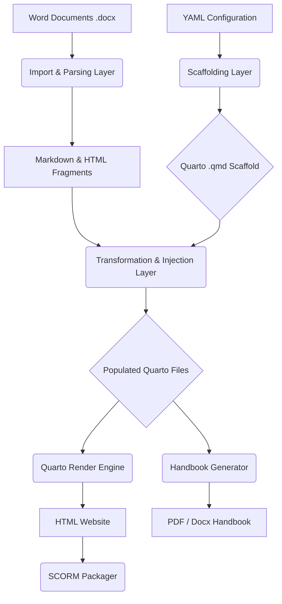

# System Architecture: CloudPedagogy Learning Publisher

The CloudPedagogy Learning Publisher operates as a multi-stage pipeline, transforming structured data (YAML) and Word documents into interactive Quarto websites and SCORM packages. 

This document details the technical architecture of this pipeline.

---

## The Transformation Pipeline

The core architecture can be visualized as a sequential pipeline:



---

## 1. The Scaffolding Layer (YAML to Quarto)

**Module:** `src/course_generator/core/`

Before any content is processed, the system must establish the physical directory structure and Quarto frontmatter that will hold the course.

1. **Config Loading:** The `ConfigLoader` reads the `course.yml` file and validates it against Pydantic schema models defined in `src/course_generator/models/schema.py`.
2. **Template Management:** The `TemplateManager` utilizes Jinja2 templates (located in the `templates/` directory) to generate standard `.qmd` structures.
3. **Generator:** The `Generator` class orchestrates the creation of the `course/<course_id>` directory. It translates the YAML hierarchy (Sessions -> Sections -> Pages) into a nested folder structure, generating `index.qmd` files for landing pages and numbered folders (e.g., `01-introduction`) to maintain a clean workspace. It also generates the required `_quarto.yml` configuration and `styles.css`.

---

## 2. The Import & Parsing Layer (Word to Markdown)

**Module:** `src/course_generator/tools/import_word.py`

Once the `.qmd` scaffold exists, the system extracts the raw content from Microsoft Word documents.

1. **Pandoc Conversion:** The system invokes Pandoc to execute a clean translation of `.docx` files into standard Markdown. It stores these intermediate files in the `imports/<course_id>/md/` directory.
2. **Normalization:** The raw Markdown often contains artifacts from Word (e.g., hard line breaks represented as trailing backslashes, or over-escaped LaTeX math delimiters). The `normalize_metadata_blocks` and `normalize_math_blocks` functions clean these artifacts so the text can be parsed reliably.

---

## 3. The Transformation & Injection Layer

**Module:** `src/course_generator/tools/import_word.py`

The system then scans the normalized Markdown for the custom CloudPedagogy syntax (e.g., `Quiz`, `R Code :: webr`, `Callout ::`) and transforms them into web-ready components.

### Syntax Parsers
- **`parse_quiz`:** Translates `Question ::`, `Option ::`, and `Answer ::` blocks into raw HTML forms styled via CSS.
- **`parse_r_code`:** Detects `R Mode ::` directives and translates them into executable Quarto code chunks (````{r}` or ````{webr-r}`).
- **`parse_tabs`, `parse_callouts`, `parse_reveal`, `parse_selfcheck`:** Translate Word blocks into their corresponding Quarto/Pandoc div equivalents (e.g., `::: {.panel-tabset}`).
- **Resource Parsing:** Re-writes file and image paths (`resources/`) to ensure they resolve correctly relative to the deeply nested `.qmd` files.

### Injection
The `insert_markdown_into_qmd` function takes this heavily transformed Markdown and injects it directly into the `.qmd` scaffold files generated during Step 1. It utilizes idempotent `<!-- IMPORT_START -->` and `<!-- IMPORT_END -->` markers to ensure repeated imports overwrite old content safely without destroying Quarto frontmatter.

---

## 4. The Render & Output Layer

With the `.qmd` files fully populated, the CLI relies on Quarto to render the final HTML site.

1. **Quarto Execution:** `coursegen render` invokes Quarto directly on the `course/<course_id>` directory, outputting the website to `output/<course_id>`.
2. **Post-Processing (SCORM):** The standalone script `tools/package_scorm.py` can be executed on the rendered HTML directory. It injects a generic JavaScript API wrapper to handle LMS communication, injects an `imsmanifest.xml`, and zips the contents for Moodle/Canvas upload.
3. **Post-Processing (Handbook):** The standalone script `tools/build_handbook_from_quarto.py` parses the `_quarto.yml` sidebar to determine page order. It strips out interactive web elements (like HTML forms and tabsets) and invokes Quarto a final time to stitch the Markdown into a contiguous PDF or Word handbook.

---

## Future Architecture Considerations: Course Engine Overlap

The **CloudPedagogy Course Engine** is focused on the *production, validation, and orchestration* of course artefacts, ensuring reproducible builds and governance. 

Currently, the Learning Publisher (this repository) operates as an independent, standalone tool handling the *content transformation* layer. 

**Recommendation:** While this repository functions well independently, its CLI commands (`build`, `import_word`, `render`) and its SCORM/Handbook tools could eventually be subsumed as specific pipeline steps within the larger Course Engine orchestration layer. For now, it should remain a standalone dependency to allow rapid iteration on the Word parsing logic.
